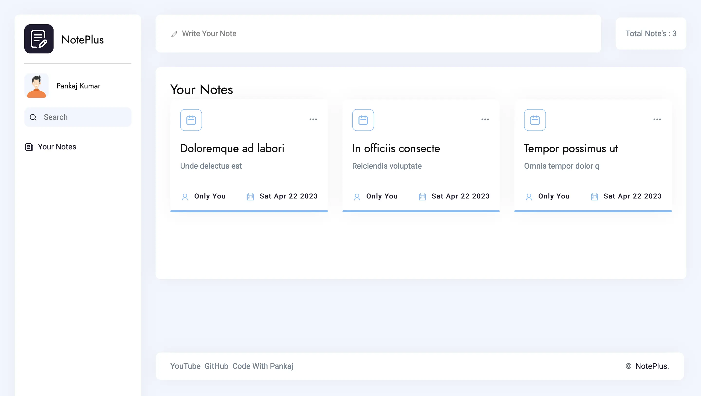

# React Notes Taking App - React

This is a simple React app for taking notes. You can create notes, delete notes, and edit notes. The app uses useState() to manage the state of the notes, and props to pass data between parent and child components.

<hr>

💙 Join the channel to see more videos like this. [Code_With_Pankaj](https://www.youtube.com/c/CodeWithPankaj1?sub_confirmation=1)
<hr>

<div align=center>

## Must visit 👇 (Click on it)

[](https://www.youtube.com/c/CodeWithPankaj1?sub_confirmation=1)

</div>

<hr>

# Features

### Create a Note
To create a new note, click the "New Note" button at the top of the screen. This will open a new note with a blank title and body. You can type your note into the body area.

### Delete a Note
To delete a note, click the delete button (trash can icon) next to the note you want to delete. This will remove the note from the list of notes.

# Code Structure
The app is structured into several components:

- `App:` the main component that renders the notes list and handles creating and deleting notes.
- `NoteList:` a component that renders the list of notes.
- `Note:` a component that renders an individual note.
- `NoteForm:` a component that handles editing and creating notes.
- The app uses useState() to manage the state of the notes. The state is stored in the App component and passed down to the child components via props.

# Authors

- [@PankajBaliyan](https://www.github.com/pankajbaliyan)


# Contributing

Pull requests are welcome. For major changes, please open an issue first to discuss what you would like to change.


# Demo

<!-- add link -->
<br><br>
<!-- add link  -->


# Feedback

If you have any feedback, please reach out to us at pankajbaliyan90@gmail.com


# 🔗 Links

[](https://codewithpankaj.vercel.app)

<a href="https://www.youtube.com/c/codewithpankaj1?sub_confirmation=1" target="blank"></a>
<a href="https://linkedin.com/in/pankaj-kumar-90" target="blank"></a><br><br>
<a href="https://leetcode.com/pankajkumar90/" target="blank"></a>
<a href="https://auth.geeksforgeeks.org/user/im_pankaj/practice/" target="blank"></a><br><br>
<a href="https://twitter.com/_pankaj_kumar__" target="blank"></a>
<a href="https://www.hackerrank.com/pankajbaliyan90" target="blank"></a>
<a href="https://discord.gg/qYz4cYc9zP" target="blank"></a>


# Lessons Learned

- `Understanding the fundamentals of React:` By creating a project that utilizes React, you likely gained a deeper understanding of the core concepts of React, including components, props, and state.

- `Using useState():` Your project utilized the useState() hook to manage the state of the notes. This likely helped you understand how to use hooks in React to manage state and update the UI based on changes to that state.

- `Passing data between components:` You used props to pass data between parent and child components in your project. This likely helped you understand how to structure your React components and how to pass data between them.

- `Managing app state:` By building a notes taking app, you likely learned how to manage the state of a larger React application. This includes handling user input, rendering the UI based on that input, and managing the state of the app as a whole.

- `Writing a README file:` In creating a README file for your project, you likely gained experience in documenting your code and making it easy for others to understand and contribute to your project. This skill is valuable for working on open source projects or collaborating with others on code.
# Run Locally

To get started, clone the repository and install the dependencies:

```bash
    git clone https://github.com/PankajBaliyan/NotePlus-React.git
    cd NotePlus-React
    npm install

```

Then start the development server:

```bash
    npm start
```

The app should open in your browser at http://localhost:3000.


# Screenshots




# Support

For support, email pankajbaliyan90@gmail.com or join our Slack channel.